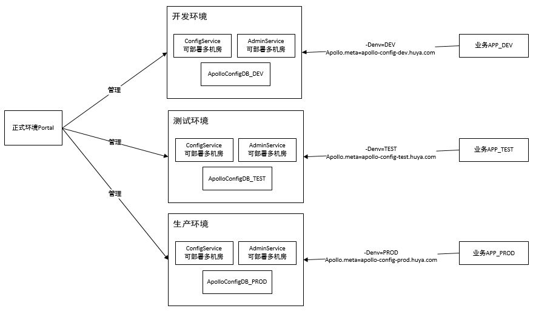
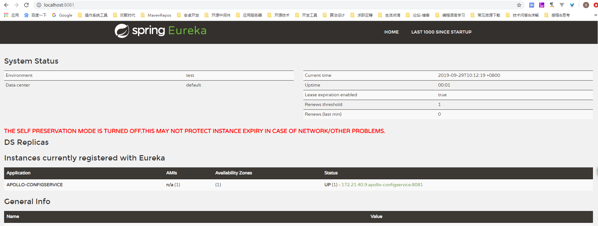
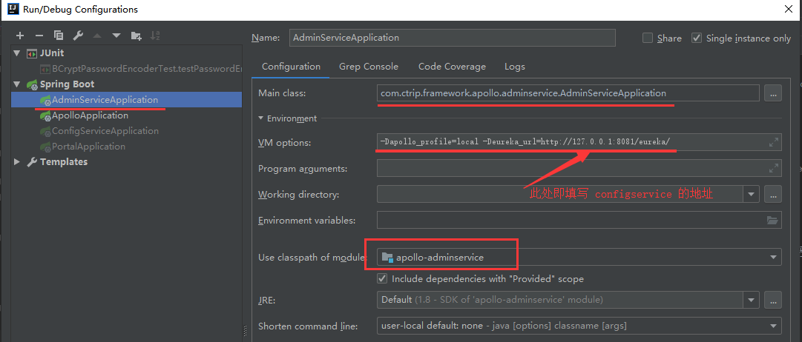
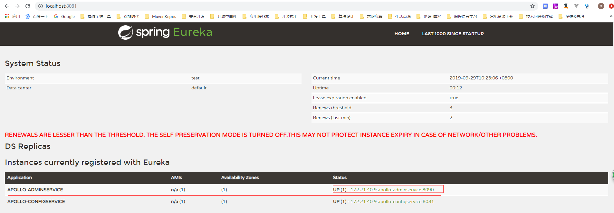
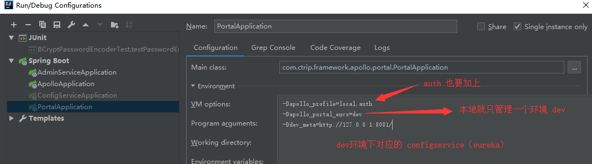
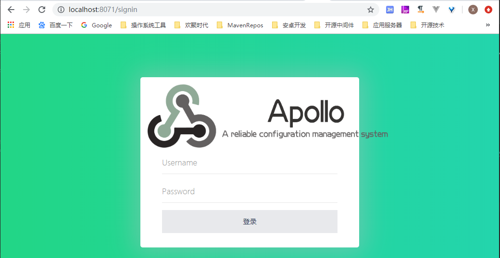

# 部署指南
## 部署架构


上图中的开发、测试、生产环境，都是给指定环境使用的，开发、测试环境使用的资源可以少一点，部署单个机房就行。

生产环境可以将 <code>ConfigService</code> 和 <code>AdminService</code> 多部署几个实例，多部署几个机房，做到应用机房级别的高可用

## 数据库准备
实际部署中，我们可以在同一个数据库实例上创建多个数据库 schema，如下所示：

|**数据库实例**|**配置环境**|**sql脚本**|
|:----|:----|:----|
|ApolloConfigDBDev|DEV|[apolloconfigdbdev.sql](scripts/docker-quick-start/sql/apolloconfigdbdev.sql)|
|ApolloConfigDBTest|TEST|[apolloconfigdbtest.sql](scripts/docker-quick-start/sql/apolloconfigdbtest.sql)|
|ApolloConfigDBProd|PROD|[apolloconfigdbprod.sql](scripts/docker-quick-start/sql/apolloconfigdbprod.sql)|
|ApolloPortalDB|PROD|[apolloportaldb.sql](scripts/docker-quick-start/sql/apolloportaldb.sql)|

注意：<code>ApolloPortalDB</code> 只需要在生产环境部署一个即可，用来管理三个环境的配置，对应的是 <code>apollo-portal</code> 模块。

apollo 默认的账号密码是 apollo/admin

如果你想修改密码，可以用 <code>org.springframework.security.crypto.bcrypt.BCryptPasswordEncoder</code> 类将你的密码进行加密，然后更新到对应数据库中，可参考测试类：<code>com.ctrip.framework.apollo.BCryptPasswordEncoderTest</code>

对应数据库表：<code>`apolloportaldb`.`users`</code>

```sql
CREATE TABLE `users` (
  `Id` int(10) unsigned NOT NULL AUTO_INCREMENT COMMENT '自增Id',
  `Username` varchar(64) NOT NULL DEFAULT 'default' COMMENT '用户名',
  `Password` varchar(64) NOT NULL DEFAULT 'default' COMMENT '密码',
  `Email` varchar(64) NOT NULL DEFAULT 'default' COMMENT '邮箱地址',
  `Enabled` tinyint(4) DEFAULT NULL COMMENT '是否有效',
  PRIMARY KEY (`Id`)
) ENGINE=InnoDB AUTO_INCREMENT=2 DEFAULT CHARSET=utf8mb4 COMMENT='用户表'
```

**建议修改默认的密码~~~~~~**

## 本地环境启动调试
### 本地环境DB
本地环境下，我们实际上不需要搞那么多个数据库，只需要一套 apollo 环境即可，因此我们本地只需要创建一个 <code>apolloportaldb</code> 和一个 <code>apolloconfigdb</code> 即可。

### 本地环境需要启动的进程
本地环境下，我们至少需要启动 <code>apollo-configservice</code>、<code>apollo-adminservice</code> 和 <code>apollo-portal</code> 三个进程，下面一一介绍

#### 启动 <code>apollo-configservice</code>
这个是需要最先启动的，相当于配置中心 Eureka 的功能 + Apollo 的配置下发服务。启动步骤如下：

- 配置 <code>application-local.properties</code> 的数据库连接信息，连接到 <code>apolloconfigdb</code> 数据库
- 直接运行类 <code>com.ctrip.framework.apollo.configservice.ConfigServiceApplication.main(String[] args)</code> 方法
- 浏览器上观察是否启动正常：
  


#### 启动 <code>apollo-adminservice</code>
<code>adminservice</code> 需要通过 <code>Eureka</code> 来发现服务，这里 <code>configservice</code> 充当了这个角色，因此在启动的时候，需要配置 <code>configservice</code> 地址：

<code>adminservice</code> 的部署步骤如下：

- 配置 <code>application-local.properties</code> 的数据库连接信息，连接到 <code>apolloconfigdb</code> 数据库
- 运行 <code>com.ctrip.framework.apollo.adminservice.AdminServiceApplication</code>,同时配置启动参数如下：
  
- 直接运行上一步骤的 <code>main</code> 方法, 然后打开 <code>configservice</code>, 会注册上来：
  

#### 启动 <code>apollo-portal</code>
该模块是用来管理不同环境的配置的一个统一管理后台，一般只需要部署一套就可以了，启动之前需要指定要管理的环境，以及对应环境的 <code>configservice</code> 地址，就本地部署而言，我们步骤如下：

- 配置 <code>application-local.properties</code> 的数据库连接信息，连接到 <code>apolloportaldb</code> 数据库
- 运行 <code>com.ctrip.framework.apollo.portal.PortalApplication</code>，同时配置启动参数如下：
  
- 打开 http://localhost:8071/ 进入登录界面
  
  
  输入账号密码，默认是 <code>apollo/admin</code>, 然后进入到后台：
  


## 生产环境部署
一般情况下我们有三套环境足够了，剩下的可以通过 <code>apollo</code> 集群的概念去管理配置，当然对应不同环境的 apollo 服务，我们是有不同的要求的，比如开发环境、测试环境下的 <code>configservice、adminservice</code> 服务，我们对于可用性没有太多的要求，我们可以就部署单个实例就好。但是对于生产环境，我们的 <code>configservice、adminservice</code> 就需要做成高可用了，甚至做到机房级别高可用。

在生产环境部署之前，我们可以规划如下：

- 开发环境
    - 单实例部署 <code>configservice, adminservice</code>
    
- 测试环境
    - 单实例部署 <code>configservice, adminservice</code>
    
- 生产环境
    - 多机房，多实例部署， <code>configservice, adminservice</code> 可以部署多机房，至少是多实例
    - <code>configservice</code> 服务提供域名进行服务的负载均衡，然后提供给使用方


部署步骤和 本地环境 下部署的类似，每一套环境都是先部署 <code>configservice, adminservice</code>, 对于 <code>apollo-portal</code> 而言，只需要部署一套就可以了，然后管理三套环境的 <code>configservice, adminservice</code>


